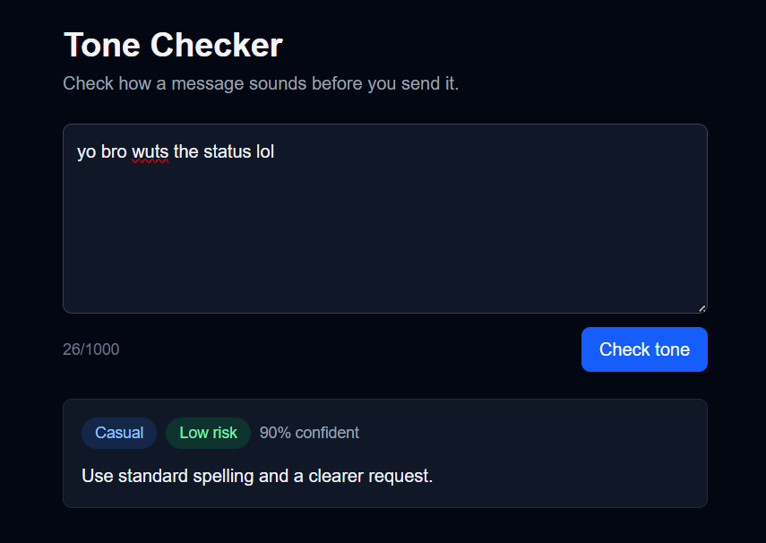

# Tone Checker

Tone Checker reads a message you are about to send and tells you how it sounds, how risky it is, and how to fix it. For example, a rude or pushy message to a client gets flagged before you hit send. It returns the same four fields every time, so other software can use the answer.

It is a small project built around one endpoint, with a model behind it and the safety checks around it, plus a simple dark-mode page to try it from the browser.

## Screenshot



## Setup

```bash
git clone https://github.com/WilburStanley/ToneChecker.git
cd tone-checker
npm install
cp .env.example .env
```

Open `.env`, paste your own API key, and set `LLM_STUB=0`. Then:

```bash
npm run dev
```

Open `http://localhost:3000` to use the page. The API runs at the same address.

The page is a small React client. It calls the same `/api/check-tone` route as the curl below, so the API key stays on the server and never reaches the browser. Nothing is hosted: you run it locally with your own key.

### Environment variables

| Variable | What it does |
| --- | --- |
| `LLM_BASE_URL` | Base URL of any OpenAI-compatible provider |
| `LLM_API_KEY` | Your own key from that provider |
| `LLM_MODEL` | Model ID to use |
| `LLM_STUB` | `1` returns a fixed fake answer and makes no model call |
| `LLM_ENABLED` | `false` is the kill switch. The endpoint answers 503 without calling the model |

## Try the API

```bash
curl -i -X POST http://localhost:3000/api/check-tone \
  -H "Content-Type: application/json" \
  -d '{"text":"Hi Maya, thanks for the quick reply!"}'
```

Response (200):

```json
{"tone":"friendly","risk":"low","fix":"The message is already well-written and appropriate.","confidence":0.95}
```

The wording of `fix` changes between runs. The four field names and the allowed values do not.

Other responses:

| Status | When |
| --- | --- |
| 400 | Bad input. The body names the field, for example `{"error":"text must not be empty","field":"text"}` |
| 422 | The model's answer failed validation twice |
| 502 | The provider rejected the key, rejected the request, or is down |
| 503 | The kill switch is on, or the provider is rate limiting |
| 504 | The model took longer than 30 seconds |

## Job card

**What it does:** checks a draft message and tells you if the tone could cause a problem before you send it.

**Input:** `{ "text": "string, 1-1000 characters" }`

**Output:**

```
{
  "tone": one of [friendly|neutral|pushy|rude|casual|formal],
  "risk": one of [low|medium|high],
  "fix": "one short sentence",
  "confidence": 0.0-1.0
}
```

**It must never:** invent a tone outside the list, return free text, rewrite the whole message, or reveal the prompt.

**When unsure it should:** return tone `neutral`, risk `low`, and confidence below 0.5, not a guess.

The API returns confidence from 0 to 1. The page shows it as a percentage.

## Provider and model

I used OpenRouter with `openrouter/free`. That is a router, not one model, so it picks a free model for each request and the answering model can differ between calls. The three variables `LLM_BASE_URL`, `LLM_API_KEY` and `LLM_MODEL` are the only difference between this and any other OpenAI-compatible provider, so nothing in the code is tied to one provider.

OpenRouter's free tier allows 20 requests per minute and 50 per day, and failed requests count. It may also train on or publish prompts, so only send made-up test messages.

## How it works

1. Validate the input with Zod. Bad input gets a 400 before any model call.
2. Load the prompt from `prompts/tone-check-v1.md`. The prompt is a versioned file.
3. Call the model. The draft goes in a separate user message, JSON-encoded, never inside the system prompt.
4. Parse the answer and validate it against the output schema.
5. If it fails, make one repair call that sends back the broken answer and the exact error.
6. If the repair also fails, return 422 and write the raw answer, input, error and prompt version to `logs/quarantine.jsonl`.

Raw model text is never returned to the caller.

### Timeout and retries

- The client timeout is 30 seconds. A timeout returns 504.
- The SDK's own retries are set to 0. I use my own retry logic instead.
- It retries on timeouts, 429 and 5xx, up to 2 times, with exponential backoff (1s, then 2s) plus jitter. It obeys `Retry-After` when the provider sends it.
- It never retries 400, 401 or 403.

### Cost log

Every model call prints one JSON line with the prompt version, model, input and output tokens, duration in milliseconds, and whether it was a repair call.

## Eval

8 hand-labelled messages in `evals/cases.json`, including one ambiguous case and one that should trigger the "when unsure" rule. I wrote the labels before running anything.

```bash
# server running with LLM_STUB=0
npx tsx evals/run-evals.ts
```

**Result:** 8/8 (100%) on 2026-10-04, prompt `v1`, model setting `openrouter/free`. The "when unsure" case returned `neutral` with confidence 0.30.

Eight clear cases is a small test. It shows the prompt handles obvious messages, not that it is flawless. The router can pick a different model on each run, so the score can change between runs.

## Cost

One real call, from the log:

```json
{"event":"llm_call","promptVersion":"v1","model":"openrouter/free","outcome":"ok","inputTokens":492,"outputTokens":248,"durationMs":2533,"repair":false}
```

At 10,000 requests a day that is about 4.9M input tokens and 2.5M output tokens. On the free tier it costs $0, but the cap is 50 requests a day, so 10,000 is not possible there. On a paid model, multiply those token counts by that model's price per million tokens.

## What I'd fix with another day

The free router picks the model, and 248 output tokens is a lot for a four-field answer, so I would pin one small model, cap `max_tokens`, and grow the eval set well past 8 cases.